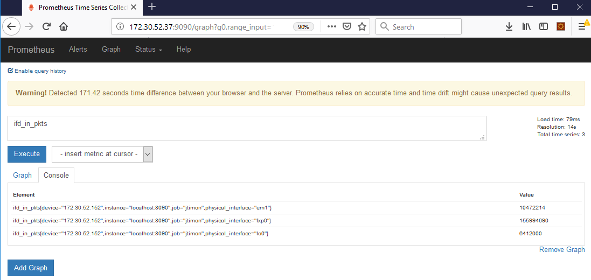
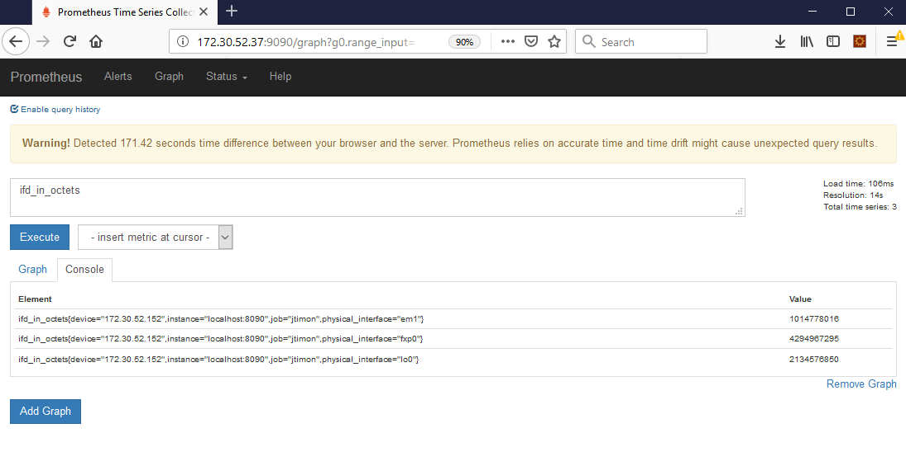
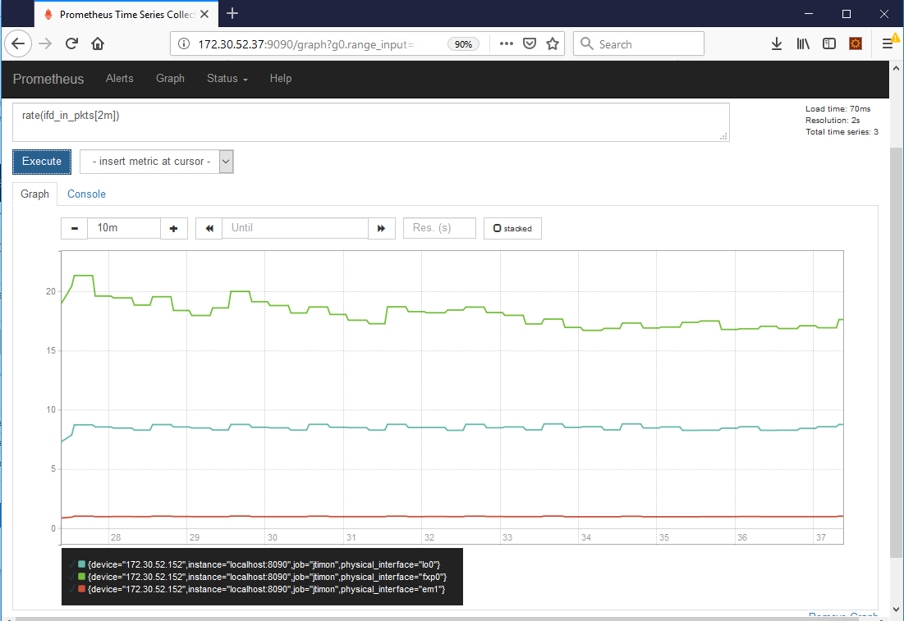
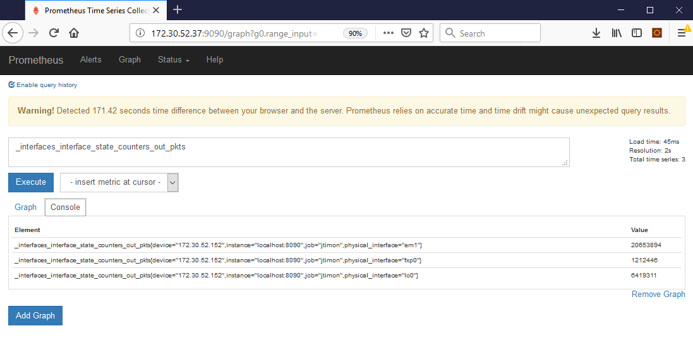
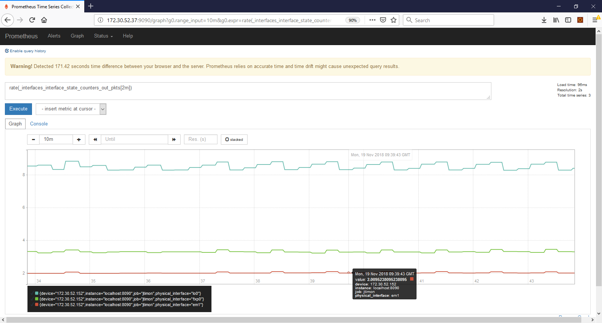
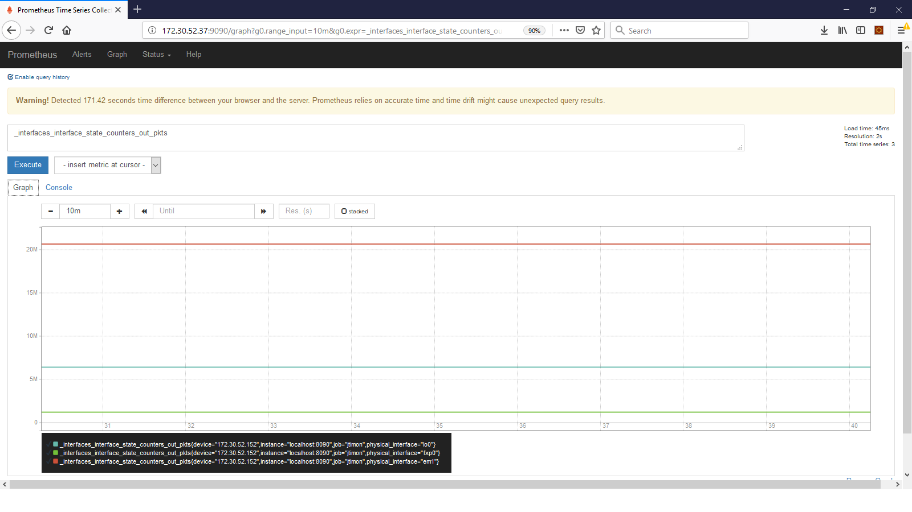

# About this repository

jtimon can collect openconfig telemetry from Junos devices  
it can also export the telemetry data received from Junos devices to Prometheus. The default export port is 8090, it is configurable.  

We will use jtimon to collect openconfig telemetry from junos devices.  
The data collected by jtimon will be exported to Prometheus

# Junos details 

## Junos version
```
lab@dc-vmx-3> show version | match telemetry
JUNOS na telemetry [17.4R1.16-C1]
```
```
lab@dc-vmx-3> show version | match openconfig
JUNOS Openconfig [0.0.0.8]
```
## Junos configuration 
```
lab@dc-vmx-3> show configuration system services extension-service | display set
set system services extension-service request-response grpc clear-text port 50051
set system services extension-service request-response grpc skip-authentication
set system services extension-service notification allow-clients address 0.0.0.0/0
```
```
lab@dc-vmx-3> show configuration system services netconf | display set
set system services netconf ssh
```
## Junos troubleshooting 
to Display information about sensors, run this command: 
```
lab@dc-vmx-3> show agent sensors
```

#  Prometheus

## About Prometheus 
https://prometheus.io/  

## Install  Prometheus
Download Prometheus
```
$ wget https://github.com/prometheus/prometheus/releases/download/v2.5.0/prometheus-2.5.0.linux-amd64.tar.gz .
```
extract the content of the archieve
```
$ tar xvfz prometheus-2.5.0.linux-amd64.tar.gz
```
```
$ cd prometheus-2.5.0.linux-amd64/
```
Verify 
```
$ ./prometheus --version
$ ./prometheus --help
```
## configure Prometheus  
update the ```prometheus.yml``` configuration file ([use this file](prometheus.yml))

```
$ vi prometheus.yml
```
## Start Prometheus
```
$ ./prometheus --config.file=prometheus.yml
```
## prometheus GUI

The url is ```http://<prometheus_ip>:9090```  

# jtimon

## About jtimon

jtimon is a grpc client.  
you can use it to collect telemetry on junos devices.  
it is opensourced and written in GO  
https://github.com/nileshsimaria/jtimon  
https://forums.juniper.net/t5/Automation/OpenConfig-and-gRPC-Junos-Telemetry-Interface/ta-p/316090  
https://github.com/nileshsimaria/jtimon/wiki/JTIMON-and-Prometheus

## Install GO 

find out which ubuntu release you are using
```
$ lsb_release -a
```
download go
```
$ wget https://dl.google.com/go/go1.11.2.linux-amd64.tar.gz
```
verify
```
$ sha256sum go1.11.2.linux-amd64.tar.gz

```
unpack the package
```
$ tar xvfz go1.11.2.linux-amd64.tar.gz
```
move the go directory to /usr/local
```
$ sudo mv go /usr/local
```
```
$ ls /usr/local/go/
```
print go version
```
$ /usr/local/go/bin/go version
```
create a directory projects
```
$ mkdir projects
```
set environment variables
- The GOPATH variable indicates places to look for Go code
- The GOROOT environment variable indicates the path you choosed to unpack the package
- The PATH environment variable specifies the directories in which the system will check when looking for commands (when a user types in a command without typing the whole path to the file on the command line)

```
$ export GOPATH=$HOME/projects
$ export GOROOT=/usr/local/go
$ export PATH=$GOPATH/bin:$GOROOT/bin:$PATH
```
Display the value of environment variables
```
$ printenv
$ echo $HOME
$ echo $GOROOT
$ echo $GOPATH
$ echo $PATH
```
print go version without typing the whole path
```
$ go version
```


## Install jtimon 
```
$ cd projects/
```
download and install packages and dependencies
```
$ go get github.com/nileshsimaria/jtimon
```
```
$ ls 
```
```
$ jtimon --help
Usage of jtimon:
      --alias-file string          File containing aliasing information
      --api                        Receive HTTP commands when running
      --compression string         Enable HTTP/2 compression (gzip, deflate)
      --config strings             Config file name(s)
      --config-file-list string    List of Config files
      --explore-config             Explore full config of JTIMON and exit
      --grpc-headers               Add grpc headers in DB
      --gtrace                     Collect GRPC traces
      --json                       Convert telemetry packet into JSON
      --latency-profile            Profile latencies. Place them in TSDB
      --log-mux-stdout             All logs to stdout
      --max-run int                Max run time in seconds
      --no-per-packet-goroutines   Spawn per packet go routines
      --pprof                      Profile JTIMON
      --pprof-port int32           Profile port (default 6060)
      --prefix-check               Report missing __prefix__ in telemetry packet
      --print                      Print Telemetry data
      --prometheus                 Stats for prometheus monitoring system
      --prometheus-port int32      Prometheus port (default 8090)
      --stats-handler              Use GRPC statshandler
      --version                    Print version and build-time of the binary and exit
```

## create a jtimon configuration file
[use this file](dc-vmx-3.json)
```
$ vi dc-vmx-3.json
```

## alias

you can use alias.  
This is optional.  
If JTIMON does not find alias, it would use the names of the path as received from JTI (it will replace '/' with '_').

```
$ cp src/github.com/nileshsimaria/jtimon/alias.txt alias.txt
```
```
$ cat alias.txt
ifd : /interfaces/interface/name
physical_interface : /interfaces/interface/@name
ifd-admin-status : /interfaces/interface/state/admin-status
ifd-oper-status : /interfaces/interface/state/oper-status
ifd-in-pkts:/interfaces/interface/state/counters/in-pkts
ifd-in-octets:/interfaces/interface/state/counters/in-octets
ifl:/interfaces/interface/subinterfaces/subinterface/index
logical-interface-index:/interfaces/interface/subinterfaces/subinterface/@index
ifl-in-ucast-pkts:/interfaces/interface/subinterfaces/subinterface/state/counters/in-unicast-pkts
ifl-in-mcast-pkts:/interfaces/interface/subinterfaces/subinterface/state/counters/in-multicast-pkts
```

## run jtimon and export data to prometheus 

run jtimon with the configuration file ```dc-vmx-3.json``` and print telemetry data and export telemetry data to prometheus  
```
$ jtimon --prometheus --prometheus-port 8090 --config dc-vmx-3.json --print --alias-file alias.txt
```

## verify jtimon is exporting telemetry data to prometheus

verify jtimon and prometheus are active
```
$ ps -ef | grep "prometheus \| jtimon"
root      1110     1  0 09:25 ?        00:00:01 ./prometheus --config.file=prometheus.yml
root      1216     1  0 09:28 ?        00:00:13 jtimon --prometheus --prometheus-port 8090 --config vmx1.json --print --alias-file alias.txt
```
verify jtimon is exporting telemetry data to prometheus
```
$ netstat -ntlp | grep 90
tcp        0      0 127.0.0.1:8090          0.0.0.0:*               LISTEN      32074/jtimon
tcp6       0      0 :::9090                 :::*                    LISTEN      32063/prometheus
```
# Use Prometheus

Open a browser and use the prometheus GUI. The url is ```http://<prometheus_ip>:9090```  

Examples  

  
  
  
  
  
  

